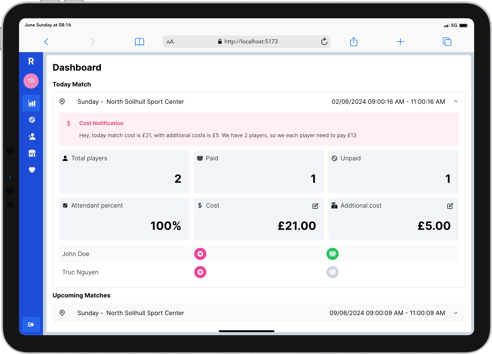
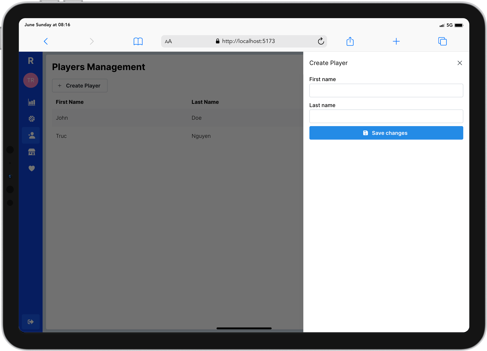
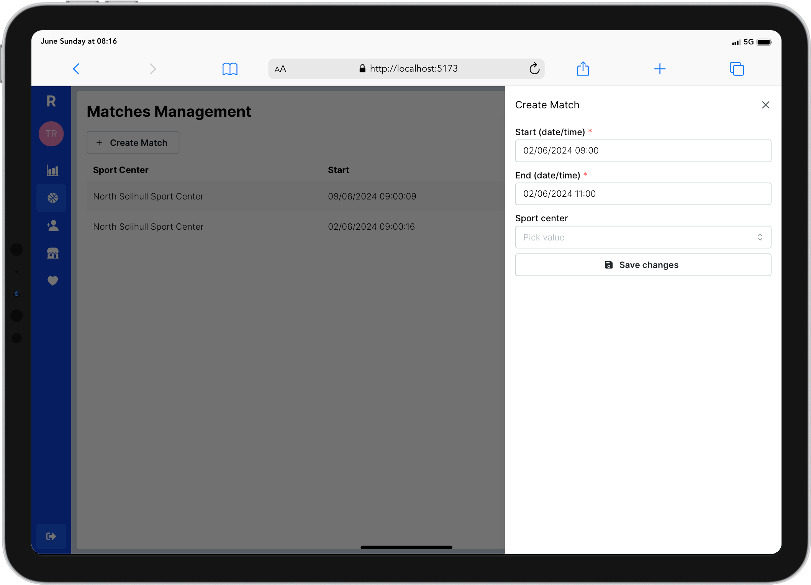
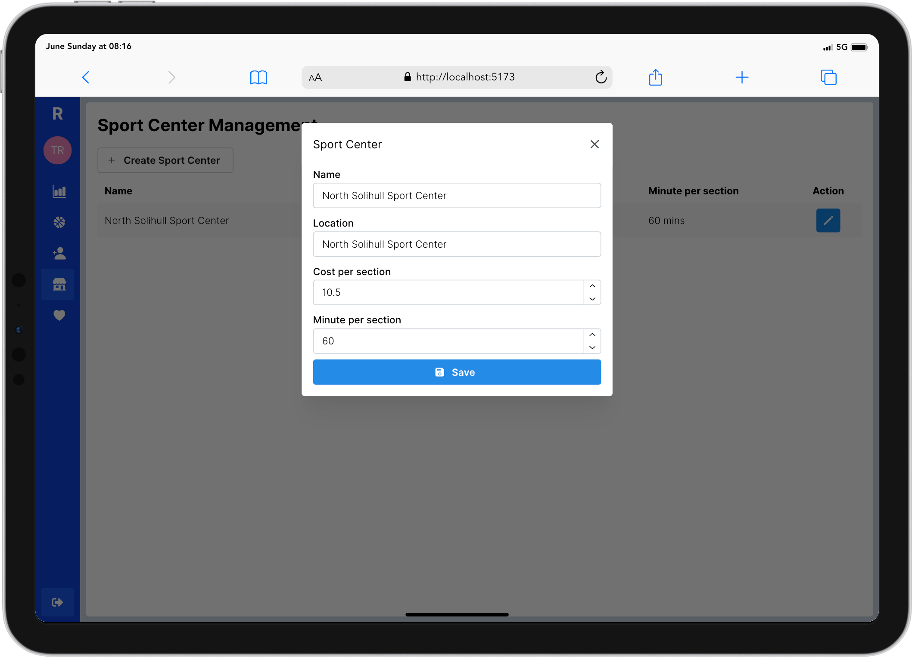

# 🏸 RACKET

[](https://github.com/truc9/racket/actions/workflows/go.yml)

## Overview
An app for amature badminton player self-organized group, manage players, courts, costs

> [!NOTE]
This project for personal hobby and learning purpose

## Usage
Must provide your own Auth0 keys in docker compose frontend service
```
environment:
    - VITE_AUTH0_DOMAIN=
    - VITE_AUTH0_CLIENTID=
```

```bash
docker compose up
```

## Roadmap
- [ ] Better database migration
- [ ] Backend authorization
- [x] Docker support
- [ ] Testing
- [x] Support cost management
- [ ] Support notification (Facebook Messenger, Email, Push Notification)
- [ ] Mobile Apps

## Demo








## Stack
- Golang Gin
- GORM with Postgres
- Auth0
- React
- Tailwindcss
- Dayjs
- Mantine UI
- Numerable


## Dev Guidline
### Run test
```bash
go test -v .\...
```
